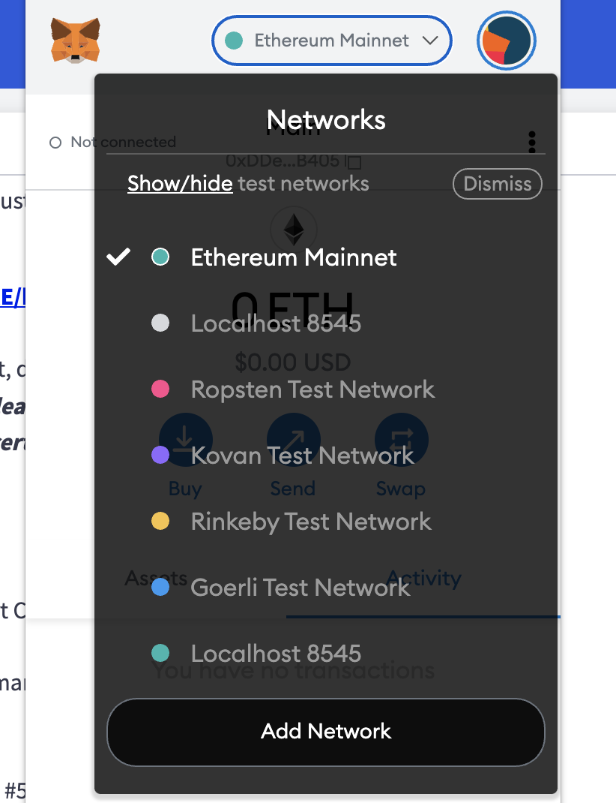

<!-- START doctoc generated TOC please keep comment here to allow auto update -->
<!-- DON'T EDIT THIS SECTION, INSTEAD RE-RUN doctoc TO UPDATE -->
**Table of Contents**  *generated with [DocToc](https://github.com/thlorenz/doctoc)*

- [LVES.io](#lvesio)
  - [Description](#description)
  - [File structure](#file-structure)
  - [Prerequisites](#prerequisites)
  - [Local Development](#local-development)
  - [Troubleshooting](#troubleshooting)
  - [Compiling for Ropsten](#compiling-for-ropsten)
  - [Testing Smart Contracts](#testing-smart-contracts)
  - [Deployed Ropsten App URL](#deployed-ropsten-app-url)
  - [Ethereum Wallet address for NFT Certificate](#ethereum-wallet-address-for-nft-certificate)
  - [Application Demo Walkthrough Video](#application-demo-walkthrough-video)

<!-- END doctoc generated TOC please keep comment here to allow auto update -->

# LVES.io
Final project for Consensys Bootcamp 2021

## Description
Lves lets you journal about life’s most important events and record the inner workings of your mind. Time and time again, journaling has been shown to improve your state of mind and clarify your thoughts. Now, you can write with the confidence that your life will be recorded on the blockchain, existing long after you are gone…your life doesn’t end with death. Together, we are recording the complex, varied lives of all humans who are alive today, and all humans yet to come.

## File structure
  * `artifacts` - Folder in which compiled smart contract artifacts are stored
  * `client` - Front-end application scaffolded using [vite](https://vitejs.dev/)
    * `dist` - production build of application
    * `src` - directory containing front-end application code
      * `assets` - holds image files
      * `components` - React components
      * `context` - React Context definitions for application state management
      * `contracts` - Smart contract files generated during compilation (necessary to be within `src` file so it is copied from outside the folder)
      * `typechain-types` - Typescript contract definitions and code created by [Typechain](https://github.com/dethcrypto/TypeChain)
      * `utils` - Utility functions
      * `views` - Application views or "pages"
  * `contracts` - Smart contract files generated during compilation
  * `test` - Smart contract unit tests

## Prerequisites
* Install Node.js (14.x+) [Node install](https://nodejs.org/en/download/)
* Have the Metamask browser extension installed. [Chrome / Brave Extension](https://chrome.google.com/webstore/detail/metamask/nkbihfbeogaeaoehlefnkodbefgpgknn?hl=en) [Firefox Extension](https://addons.mozilla.org/en-US/firefox/addon/ether-metamask/)
* Add a `"Custom RPC"` in Metamask with `Network Name - Localhost 8545` `New RPC URL - http://127.0.0.1:8545` `Chain ID - 1337` (Note: Make sure to use `127.0.0.1` and not `localhost` as `localhost` seemingly does not resolve correctly on `Brave` and `Chrome` browsers). **See the image below on where to start adding a custom network**.

 

 

## Local Development
* Install all project dependencies by running `npm run install-all-deps`
* Add a `.env.local` file to the `/client` directory and add the following `VITE_CHAIN_ID=1337`
* Start the Hardhat development console `npm run start-local-node`. The `chain id` is configured to be `1337`. When your local node is running you should see the text  Started HTTP and WebSocket JSON-RPC server at http://127.0.0.1:8545/` showing that the port is running on `8545`.
* Compile and deploy contracts by opening a new tab in your terminal and from within the root directory running `npm run deploy:dev`
* Grab your ETH Wallet Address from Metamask and add some test ETH to it with `npm run faucet ${YOUR_WALLET_ADDRESS}`. Example: `npm run faucet 0xf39fd6e51aad88f6f4ce6ab8827279cfffb92266`
* Start the client by opening a new tab in your terminal and from within the root directory running `npm start-client`
* In your browser, navigate to `http://localhost:7777` where you should see the app running

[Starting local env video](https://share.getcloudapp.com/P8u8wlKg)

## Troubleshooting

- If you are testing locally and come across an error that says something similar to `Nonce too high. Expected nonce to be 0 but got 19. Note that transactions can't be queued when automining.`, follow the steps in this link to fix. [https://dev.to/nmassi/comment/1dafo](https://dev.to/nmassi/comment/1dafo).

## Compiling for Ropsten
  - update your `.env` file int he root of the project to include you `ROPSTEN_URL` and `PRIVATE_KEY` (You can generate this from [alchemy.io](https://www.alchemyapi.io))
  - run `npm run deploy:ropsten`.
  - once this has compiled update the `VITE_CHAIN_ID` in `.env.local` in the `client` folder to the chain id for Ropsten, which is **3**. `VITE_CHAIN_ID=3`
  - run `npm run build-client` (After this is run your frontend app can be deployed to the host of your choosing and will be expecting a contract on Ropsten)

## Testing Smart Contracts
  Smart contract tests are in the `test` folder in the top level of the project. To run them use the following command `npm run test`.

## Deployed Ropsten App URL
https://lves-ropsten.vercel.app/

## Ethereum Wallet address for NFT Certificate
`0xDDe49681e68B12Ec4FBB65e8663782DC18F0B405`

## Application Demo Walkthrough Video
https://share.getcloudapp.com/xQujQvw6
